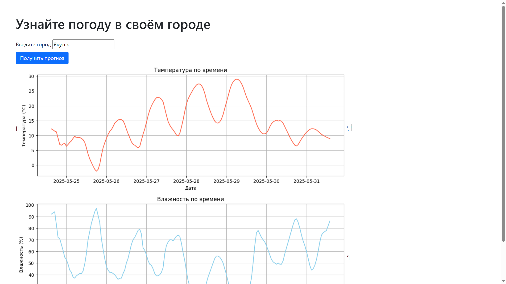

# Веб-приложение с прогнозом погоды
*Work in progress*


Главная страница

Страница админа с добавленными городами


## Инструменты
- **Django** - веб-фрейморк
- **SQLite** - база данных
- **[Open-meteo](https://open-meteo.com/)** - API для погоды
- **Bootstrap** - стили
- Список городов России для БД взят [по ссылке](https://github.com/hflabs/city)

## Как запустить
1. Установка библиотек  
```python
pip install -r requirements.txt
```
2. Миграции БД
```python
python manage.py makemigrations weather
python manage.py migrate weather
```
3. В папке weather_app (основной папке приложения) выполнить импорт городов
```python
cd weather_app
python manage.py import_cities
```
4. Запуск приложения
```python
py manage.py runserver
```
5. Перейдите на главную страницу приложения
http://127.0.0.1:8000/weather/

## Планы
Что не получилось выполнить за время, данное на это тестовое задание *(= за выходные)*
- Перевести в docker-контейнер, в т.ч. чтобы приложение запускалось не таким количеством действий
- Тесты
- Добавить автодополнение в форму (в коммите [b40fa8d](https://github.com/captaincod/django-weather-app/commit/b40fa8d5368beb9b5ff514b7b9193ee8a04cd82c) не получилось)
- Сохранение истории поиска для каждого пользователя + API, показывающее, сколько раз вводили какой город