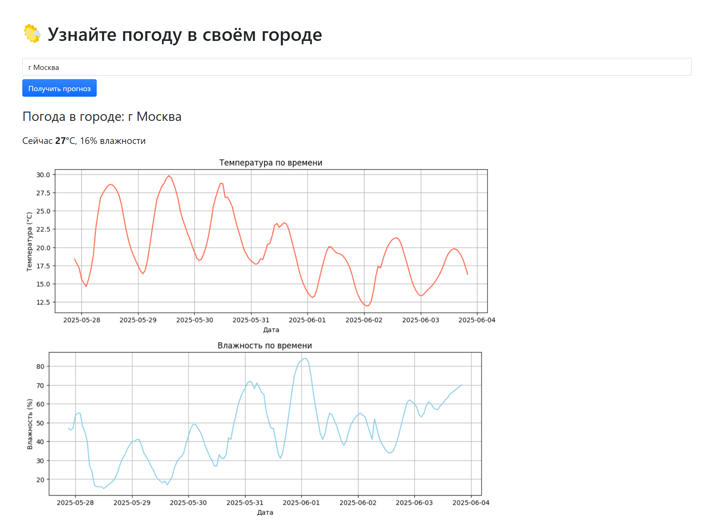

# Веб-приложение с прогнозом погоды
*Work in progress*

## Скриншоты
**Главная страница**  
  

---

  
**Страница админа** с добавленными городами
  


## Инструменты
- **Django** - веб-фрейморк
- **SQLite** - база данных
- **[Open-meteo](https://open-meteo.com/)** - API для погоды
- **Docker** - запуск приложения
- **Bootstrap** - стили
- **[Flaticon](https://www.flaticon.com/packs/meteorology)** - иконки
- Список городов России для БД взят [по ссылке](https://github.com/hflabs/city)

## Как запустить с помощью Docker
1. Перейдите в папку приложения 
```bash
cd weather_app
```
2. Создайте файл `.env` и заполните его по примеру ниже
```bash
SECRET_KEY=ваш_ключ
DEBUG=True
DJANGO_LOGLEVEL=info
DJANGO_ALLOWED_HOSTS=localhost,127.0.0.1
```
3. Создайте контейнер и запустите его
```bash
docker compose build
docker compose up
```
4. Перейдите на главную страницу приложения  
http://localhost:8000/ (или другой хост, кооторый вы прописали в env)

## Планы
Сейчас работает:  
✅ Поиск города России с автодополнением  
✅ Получение графиков температуры и влажности  
✅ Работа из Docker

Что не получилось выполнить за время, данное на это тестовое задание
- Тесты
- Сохранение истории поиска для каждого пользователя + API, показывающее, сколько раз вводили какой город